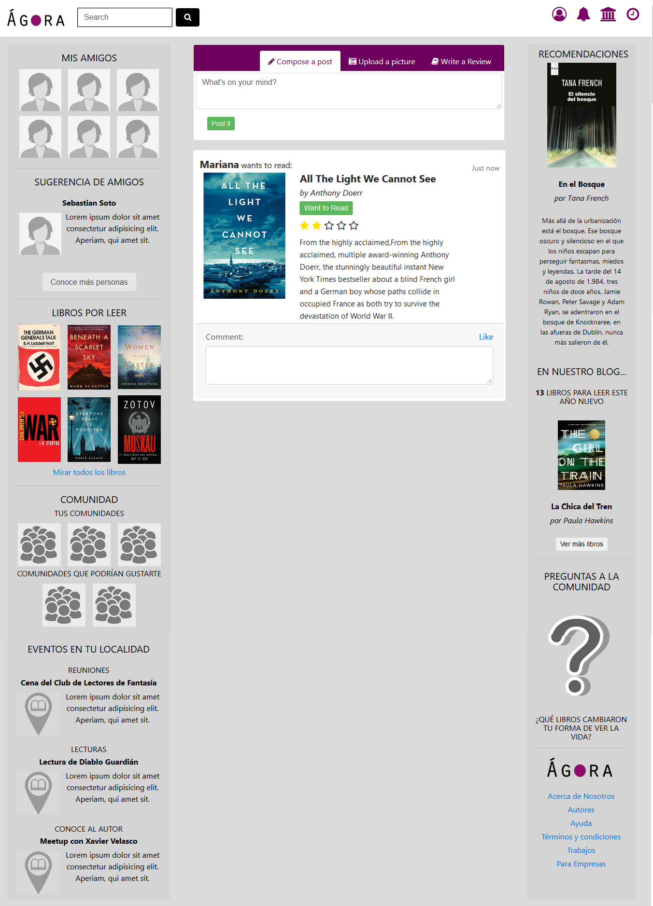
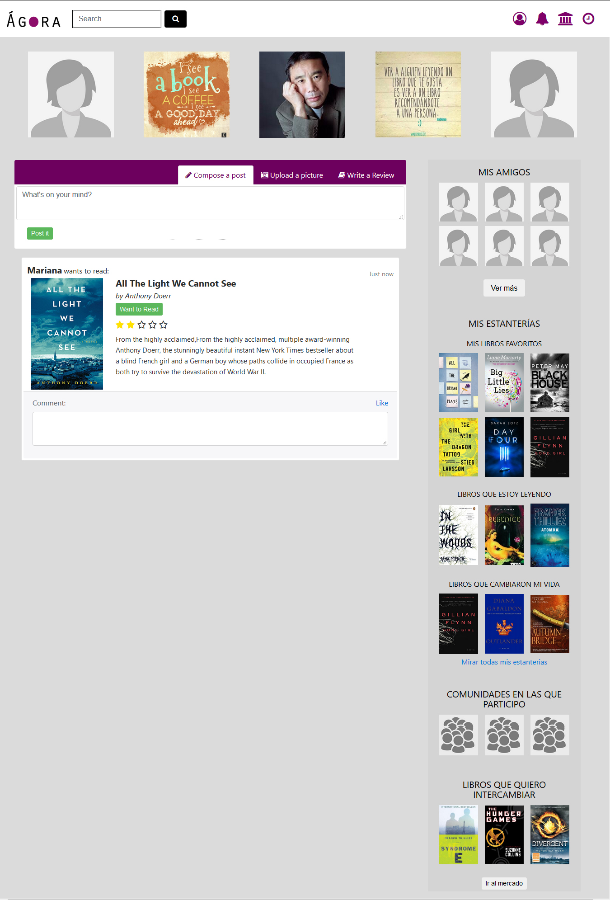
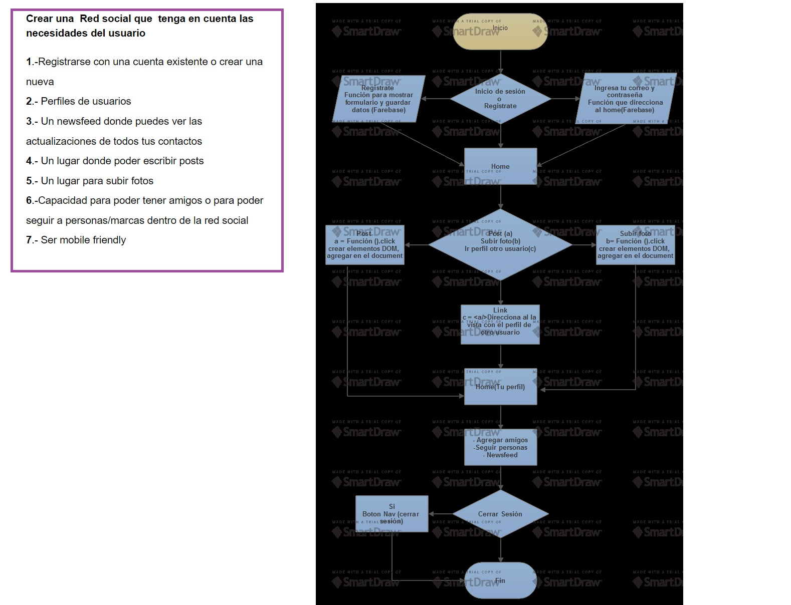

# Proyecto Red Social 

## Definición del proyecto

El proyecto consiste en desarrollar una red social para lectores en las que puedan compartir lo que están leyendo con sus amigos y también conocer nueva gente. Además de ofrecer un espacio para la formación de comunidades y de eventos de interés. 

### Gestión de requerimientos

Además de las encuestas a un público general, también realizamos encuestas más exhaustivas a nuestro público especializado. Aquél que sería nuestro user-target ya que entre sus principales hobbies se encuentra la lectura.  

Lo que se ve a continuación es el resultado de dichas encuestas especializadas. 

#### Necesidades del usuario

En estas encuestas ahondamos en cuáles eran las necesidades de nuestro user-target, es decir, qué características encontraban necesarias para que estuvieran interesados en formar parte de nuestra red social. Más abajo se encuentra una lista de las características más importantes.

1. Capacidad de ver eventos locales de interés. 
2. Capacidad de ver lo que sus amigos están leyendo/haciendo. 
3. Publicar imágenes. 
4. Postear cosas, generar contenido.  
5. Recibir notificaciones. 
6. Capacidad de seguir a autores/personas. 
7. Capacidad de taggear. 
8. Capacidad de conocer personas. 
9. Capacidad de obtener información automática de libros al escanear un código de barras o código QR. 
10. Publicar reviews/criticas. 
11. Tener “estantes” para crear sus propias listas de libros. 
12. Revisar estadísticas.  
13. Capacidad de intercambiar libros. 
14. Obtener información inmediata. 
15. Crear grupos de lectura y meetups. 
16. Recibir recomendaciones interactivas y que sean capaces de “aprender”. 

#### Objetivos del sitio: Cuál es el fin de nuestro sitio web

Mediante esta exhaustiva investigación logramos entender cuál era el objetivo que nuestro sitio debería de cumplir.  Nuestros objetivos se enlistan más abajo: 

1. Unir a lectores con autores. 
2. Generar sentido de la comunidad.
3. Enfatizar el aspecto social de la lectura. 
4. Incentivar conversaciones y debates sobre temas literarios.
5. Conectar personas en base a sus gustos (por autores o género). 
6. Generar información accesible para incentivar la obtención de conocimiento. 
7. Reactivar la comunidad de lectores. 

#### Necesidades del proyecto: Qué es lo que el proyecto necesita para ser exitoso

En base a nuestros objetivos, con el feedback que recibimos por parte de los encuestamos pudimos encontrar aquellas necesidades básicas que deberían de ser cumplidas para que logremos ocupar un nicho en el mercado y posicionarnos por encima de la competencia, dichas necesidades están listadas más abajo: 

1. Cumplir con las necesidades de los usuarios.
2. Presentar información de forma clara.
3. Énfasis en aspecto social. 
4. Diseño visual satisfactorio.
5. Navegación fácil e intuitiva.
6. Capacidad para implementar nuevas características a futuro.

### Propuesta de diseño (prototipado)

 

 

### Estructura de la página web

La estructura de la página web consta de: 

1. Pantalla de Inicio. 
    1.1 Registrarse. 
    1.2 Log-In. 

2. Home  
    2.1 Barra de navegación. 
        2.1.1 Branding (Logo)
        2.1.2 Botón de búsqueda general. 
        2.1.3 Actualizaciones. 
        2.1.4 Comunidades. 
        2.1.5 Time-Line.  
        2.1.6 Perfil. 
    2.2 Barra lateral izquierda.  
        2.2.1 Amigos. 
        2.2.2 Sugerencia de amigos. 
        2.2.3. Libros por leer. 
        2.2.4 Comunidad. 
        2.2.5. Eventos localidad. 
    2.3 Barra lateral derecha. 
        2.3.1 Recomendaciones. 
        2.3.2 Blog. 
        2.3.3 Preguntas a la comunidad
        2.3.4 Footer. 
    2.4 Main 
        2.4.1 Funcionalidad de postear. 
        2.4.2 Muro. 

    3. Perfil 
        3.1 Barra de navegación local. 
            3.1.1 Sobre mí. 
            3.1.2 Mis libros.
            3.1.3 Mis fotos. 
            3.1.4 Ver más. 
        3.2 Fotos. 
        3.3 Main 
            3.1.1 Funcionalidad de postear. 
            3.1.2 Muro. 
        3.4 Barra lateral derecha. 
            3.4.1 Mis amigos. 
            3.4.2 Mis estanterías. 
            3.4.3 Mis comunidades. 
            3.4.4 Mi mercado. 

### Diseño visual

Para la realización del sitio web seguimos los principios del minimalismo, nuestra paleta de colores estuvo dominada por un set de colores entre morado y amarillo. Principalmente porque no existe ninguna red social que use esos colores, por lo cual tendremos la capacidad de generar nuestro propio branding. Y también porque ligado con la comunidad de lectores el morado representa la elegancia y la intelectualidad que tanto caracteriza a nuestro user-target. También buscamos representar los libros por su portada en la mayoría de los casos ya que en nuestras encuestas encontramos que los lectores juzgan un libro, en primera instancia, por la portada.

### Diseño de navegación

Dentro del diseño de la navegación se buscó crear una navegación sencilla y ampliamente intuitiva con una curva de aprendizaje mínima. Tenemos una barra de navegación global con una cantidad mínima de íconos, evitando los menús dropdown para evitar la saturación del usuario. En los perfiles encontramos una barra de navegación global que sirve únicamente para moverse a través de los perfiles.  

### Diseño de la información

Principalmente se buscó que la información presentada fuera precisa y concisa, otorgándole a los usuarios solo la información que ellos consideradon primordial durante las encuestas. Es así como decidimos que, de los libros, la cuestión más importante fue el título, autor, portada y un breve resumen.  

### Planeación de la interactividad

En este apartado se detallará la interactividad que por medio de la planeación obtuvimos como necesaria para tener una funcionalidad básica. 

#### Necesidades interactivas

1. Log In (Firebase). 
2. Postear imágenes. 
3. Colocar contenido  en Timeline. 
4. Escribir reviews. 
5. Seguir personas/marcas. 
6. Buscar libros por ISBN. 

### Pseudocódigo (Diagrama de flujo)

 
 
 
 #### Planeación 
 
 Adjuntamos un link de Trello 
 https://trello.com/b/de45qlyN
